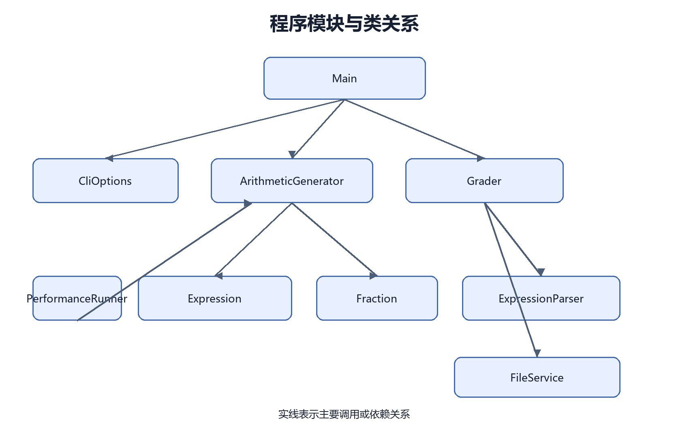
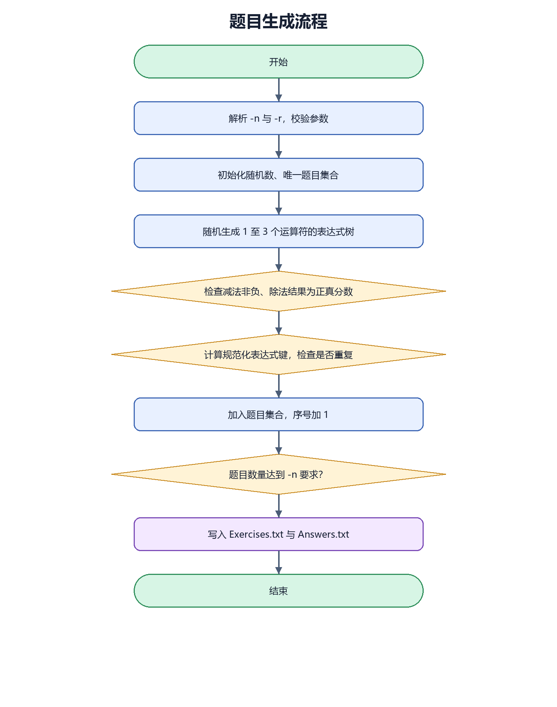
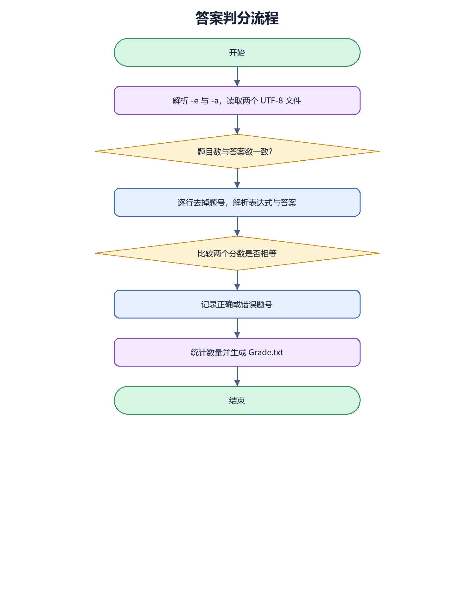

# 第一次个人编程作业：小学四则运算题目生成器

姓名：ZYY（请替换为真实姓名）  
学号：待补充  
结对伙伴：待补充  
结对伙伴学号：待补充  

GitHub 项目地址：<https://github.com/ZYY190/PrimaryArithmeticGenerator>

## 一、题目要求与约束

本次作业需要实现一个自动生成小学四则运算题目的命令行程序。程序以 `-n` 指定题目数量，以 `-r` 指定题目中自然数、真分数分子和分母的范围，并生成 `Exercises.txt` 与 `Answers.txt`。此外，程序还需要支持 `-e` 和 `-a` 参数，对给定题目和答案逐题判分并生成 `Grade.txt`。

我在实现时把要求拆成四类：

1. 命令行与文件输出；
2. 分数和表达式模型；
3. 题目随机生成、约束检查与去重；
4. 表达式解析和答案判分。

程序使用 Java 17 编写，不依赖第三方 Java 库。这样做的好处是项目可以直接在 IntelliJ IDEA 中打开和运行，也可以使用 `javac`、`jar` 在命令行完成构建。

## 二、PSP2.1 计划

| PSP2.1 | 预估耗时（分钟） | 实际耗时（分钟） |
| --- | ---: | ---: |
| Planning / 计划 | 10 | 1 |
| Estimate / 估计任务时间 | 10 | 1 |
| Analysis / 需求分析 | 30 | 1 |
| Design Spec / 生成设计文档 | 20 | 1 |
| Design Review / 设计复审 | 10 | 1 |
| Coding Standard / 代码规范 | 10 | 1 |
| Design / 具体设计 | 40 | 1 |
| Coding / 具体编码 | 180 | 5 |
| Code Review / 代码复审 | 30 | 1 |
| Test / 测试与修改 | 60 | 3 |
| Test Report / 测试报告 | 30 | 1 |
| Size Measurement / 计算工作量 | 10 | 1 |
| Postmortem & Process Improvement Plan / 事后总结 | 20 | 1 |
| 合计 | 460 | 19 |

说明：提交前应结合个人和结对伙伴的真实开发时间再次核对，不能直接把占位信息作为最终记录。

## 三、效能分析

### 3.1 测试方法

我在 `BenchmarkSuite` 中对 1,000、5,000、10,000、50,000 和 100,000 道题分别重复运行三次，取中位数。测试范围为 `r = 100`，每题运算符数量为 1 至 3。

### 3.2 测试数据

| 题目数量 | 中位耗时（ms） | 最短耗时（ms） | 每题中位耗时（ms） |
| ---: | ---: | ---: | ---: |
| 1,000 | 3 | 2 | 0.003000 |
| 5,000 | 22 | 17 | 0.004400 |
| 10,000 | 40 | 27 | 0.004000 |
| 50,000 | 109 | 100 | 0.002180 |
| 100,000 | 231 | 227 | 0.002310 |


### 3.3 消耗最大的函数

我使用 `ProfilingRunner` 对 300,000 道题的生成过程进行线程栈采样，采样间隔为 1 毫秒，共得到 292 个有效样本。排名前 8 的方法如下：

| 排名 | 方法 | 样本数 | 占比 |
| ---: | --- | ---: | ---: |
| 1 | `java.math.BigInteger.smallToString` | 54 | 18.49% |
| 2 | `java.math.MutableBigInteger.binaryGcd` | 50 | 17.12% |
| 3 | `java.math.BigInteger.toString` | 24 | 8.22% |
| 4 | `java.math.BigInteger.multiply` | 15 | 5.14% |
| 5 | `ArithmeticGenerator.generateUniqueExpression` | 15 | 5.14% |
| 6 | `java.math.BigInteger.multiplyByInt` | 12 | 4.11% |
| 7 | `java.lang.Object.clone` | 11 | 3.77% |
| 8 | `java.math.MutableBigInteger.clear` | 10 | 3.42% |

主要耗时集中在分数约分和规范化键的字符串生成上。每次分数运算后都会约分，而每次生成题目后都需要递归构造表达式键，因此 `BigInteger` 的 GCD 和 `toString` 排名靠前。考虑到 `r` 可能较大，我保留 `BigInteger`，避免为了很小的速度提升引入整数溢出风险。

### 3.4 优化思路

我尝试从三个方向降低耗时：

1. 使用 `HashSet<String>` 保存规范化键，使重复检查的平均时间为常数级；
2. 表达式树最多只有 3 个运算符，递归层数固定，避免不必要的深度；
3. 只在约束检查通过后计算规范化键，减少无效字符串构造。

当前版本生成 10,000 道题的中位耗时为 40 ms，生成 100,000 道题的中位耗时为 231 ms，已经满足 10,000 道题的性能要求。

## 四、设计实现过程

### 4.1 总体结构



项目主要包含以下类：

| 类或接口 | 职责 |
| --- | --- |
| `Main` | 命令行入口，根据参数选择生成或判分流程 |
| `CliOptions` | 解析并校验参数 |
| `Fraction` | 分数约分、四则运算、比较和显示 |
| `Operator` | 运算符、优先级、交换性和计算规则 |
| `Expression` | 表达式树，包含数字节点和二元运算节点 |
| `ArithmeticGenerator` | 随机生成满足约束且不重复的题目 |
| `ExpressionParser` | 使用递归下降法解析表达式和分数 |
| `Question` | 保存题号、表达式和标准答案 |
| `FileService` | 写入题目、答案和判分结果 |
| `Grader` | 读取题目与答案，统计正确和错误题号 |
| `BenchmarkSuite` | 多规模性能测试 |
| `ProfilingRunner` | 线程栈采样热点分析 |

### 4.2 题目生成流程



生成器先随机确定 1 至 3 个运算符，再递归生成表达式树。父节点得到左右子表达式的值后执行约束检查：

- 减法要求左值不小于右值，否则交换左右子树；
- 除法要求结果为正真分数，即左值大于 0 且小于右值；
- 如果除法条件无法满足，就放弃当前表达式并重新生成。

### 4.3 判分流程



判分类会读取两个 UTF-8 文件，去除每行的序号和空格，再解析题目左侧表达式与答案文件中的分数。由于 `Fraction` 会自动约分，`5/10` 和 `1/2` 会被正确判断为同一个答案。

### 4.4 去重规则

去重没有直接比较题目字符串，而是为表达式树生成规范化键。加法和乘法的左右子树会按键排序，减法和除法不排序。这样既能让 `23 + 45` 和 `45 + 23` 判为重复，也能保留 `1 + 2 + 3` 与 `3 + 2 + 1` 的结构差异。

## 五、代码说明

### 5.1 分数类

```java
public static Fraction of(BigInteger numerator, BigInteger denominator) {
    if (denominator.signum() == 0) {
        throw new ArithmeticException("分母不能为 0");
    }
    if (denominator.signum() < 0) {
        numerator = numerator.negate();
        denominator = denominator.negate();
    }
    BigInteger gcd = numerator.gcd(denominator);
    return new Fraction(numerator.divide(gcd), denominator.divide(gcd));
}
```

这段代码保证分数始终以最简形式保存，并且分母始终为正。所有加减乘除结果都通过该入口创建，因此判分和答案输出不会出现未约分的情况。

### 5.2 表达式规范化

```java
@Override
public String canonicalKey() {
    String leftKey = left.canonicalKey();
    String rightKey = right.canonicalKey();
    if (operator.isCommutative() && leftKey.compareTo(rightKey) > 0) {
        String temporary = leftKey;
        leftKey = rightKey;
        rightKey = temporary;
    }
    return "(" + operator.name() + ":" + leftKey + "," + rightKey + ")";
}
```

`BinaryNode` 使用递归方式生成键。对加法和乘法交换左右键，对减法和除法保持左右顺序。这样既满足交换律去重，也不会错误地把结合顺序不同的题目当成同一道。

### 5.3 生成约束

```java
case SUBTRACT -> {
    if (leftValue.compareTo(rightValue) >= 0) {
        yield new Expression.BinaryNode(operator, left, right);
    }
    yield new Expression.BinaryNode(operator, right, left);
}
case DIVIDE -> {
    if (rightValue.isZero() || leftValue.isZero() || leftValue.equals(rightValue)) {
        yield null;
    }
    if (leftValue.compareTo(rightValue) > 0) {
        Expression temporary = left;
        left = right;
        right = temporary;
    }
    yield new Expression.BinaryNode(operator, left, right);
}
```

减法和除法在树上直接调整左右子树，保证每个减法中间结果非负，每个除法结果都是正真分数。运算符数量由递归层数严格限制为 1 至 3。

## 六、测试运行

### 6.1 自动化测试命令

```powershell
.\scripts\run-tests.ps1
```

实际输出：

```text
ALL TESTS PASSED
```

### 6.2 测试用例

| 编号 | 测试内容 | 预期结果 | 结果 |
| --- | --- | --- | --- |
| 1 | `Fraction.of(3, 5)` | `3/5` | 通过 |
| 2 | `Fraction.of(3, 2)` | `1’1/2` | 通过 |
| 3 | `1/6 + 1/8` | `7/24` | 通过 |
| 4 | `2/4 - 1/2` | `0` | 通过 |
| 5 | `2’3/8 + 1/8` | `2’1/2` | 通过 |
| 6 | `3 + (2 + 1)` | `6` | 通过 |
| 7 | `1 + 2 + 3` 与 `3 + (2 + 1)` | 规范化键相同 | 通过 |
| 8 | `1 + 2 + 3` 与 `3 + 2 + 1` | 规范化键不同 | 通过 |
| 9 | 生成 500 道题，`r=20` | 减法非负、除法真分数、运算符不超过 3 | 通过 |
| 10 | 检查 500 道题的规范化键 | 全部唯一 | 通过 |
| 11 | 生成 10,000 道题，`r=100` | 成功生成 | 通过 |
| 12 | 3 道题中有 1 道错 | 正确题号 1、3，错误题号 2 | 通过 |

### 6.3 为什么可以判断程序正确

第一，分数统一约分，避免浮点误差和等价分数误判。第二，每个生成表达式都会被重新解析，并与原表达式值比较。第三，测试递归检查每个减法节点和除法节点，分别验证非负约束和真分数约束。第四，去重测试把全部规范化键放入集合，集合大小必须等于题目数量。最后，判分测试使用可以手工验证的题目，例如 `2 × 3 = 6`，并故意提供错误答案检查题号统计。

## 七、运行说明

### 7.1 生成 10 道题

```powershell
.\Myapp.cmd -n 10 -r 10
```

输出文件：

- `Exercises.txt`
- `Answers.txt`

### 7.2 生成 10,000 道题

```powershell
.\Myapp.cmd -n 10000 -r 100
```

### 7.3 判分

```powershell
.\Myapp.cmd -e Exercises.txt -a Answers.txt
```

输出文件：

- `Grade.txt`

判分结果示例：

```text
Correct: 9 (1, 2, 3, 4, 5, 6, 7, 8, 10)
Wrong: 1 (9)
```

### 7.4 在 IDEA 中运行

使用 IntelliJ IDEA 打开项目，JDK 选择 17，将 `src/main/java` 标记为 Sources Root，将 `src/test/java` 标记为 Test Sources Root。运行 `com.zyy.arithmetic.Main`，在 Program arguments 中填写：

```text
-n 10 -r 10
```

或填写判分参数：

```text
-e Exercises.txt -a Answers.txt
```

## 八、项目小结

本次项目让我更清楚地认识到，随机生成程序的重点不是“生成”，而是生成之后如何验证约束、如何定义等价题目，以及如何让结果可以被稳定复现。题目看似简单，但减法、除法和去重规则会互相影响：如果只在最终答案上检查，嵌套表达式仍然可能产生负数中间结果；如果只根据字符串去重，交换律等价题会漏掉。

结对开发的主要经验是先明确数据结构和判定规则，再写生成逻辑。`Fraction` 和 `Expression` 的职责稳定之后，生成器、解析器和判分器都可以独立实现和测试。后续如果继续改进，可以增加图形界面、题目难度分级和更细的异常提示。

结对感受与闪光点（请根据真实情况补充）：

- 我的感受：待补充。
- 结对伙伴的感受：待补充。
- 我看到的闪光点：待补充。
- 给彼此的建议：待补充。

