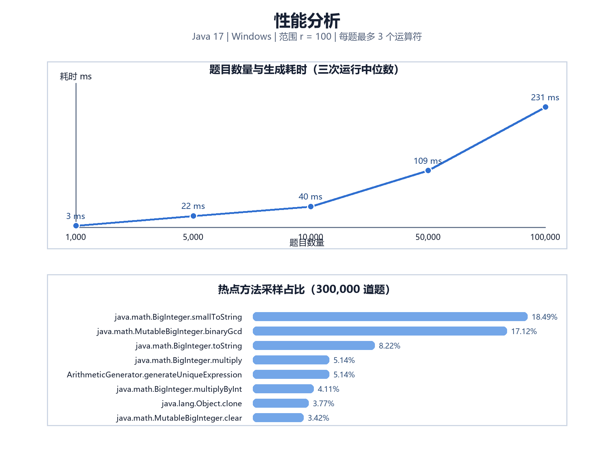

# 效能分析

## 测试环境

- Java：OpenJDK/Oracle JDK 17
- 操作系统：Windows
- 数值范围：`r = 100`
- 每题运算符数量：1 至 3
- 每组规模重复 3 次，取中位数

## 多规模生成耗时

| 题目数量 | 中位耗时（ms） | 最短耗时（ms） | 每题中位耗时（ms） |
| ---: | ---: | ---: | ---: |
| 1,000 | 3 | 2 | 0.003000 |
| 5,000 | 22 | 17 | 0.004400 |
| 10,000 | 40 | 27 | 0.004000 |
| 50,000 | 109 | 100 | 0.002180 |
| 100,000 | 231 | 227 | 0.002310 |

## 热点方法

使用 `ProfilingRunner` 对 300,000 道题的生成过程进行 1 毫秒线程栈采样，共获得 292 个有效样本。前 8 个热点方法如下：

| 排名 | 方法 | 样本数 | 占比 |
| ---: | --- | ---: | ---: |
| 1 | `java.math.BigInteger.smallToString` | 54 | 18.49% |
| 2 | `java.math.MutableBigInteger.binaryGcd` | 50 | 17.12% |
| 3 | `java.math.BigInteger.toString` | 24 | 8.22% |
| 4 | `java.math.BigInteger.multiply` | 15 | 5.14% |
| 5 | `ArithmeticGenerator.generateUniqueExpression` | 15 | 5.14% |
| 6 | `java.math.BigInteger.multiplyByInt` | 12 | 4.11% |
| 7 | `java.lang.Object.clone` | 11 | 3.77% |
| 8 | `java.math.MutableBigInteger.clear` | 10 | 3.42% |

原始数据见 `docs/data/performance-runs.csv` 和 `docs/data/profile-methods.csv`。

## 热点解释与改进思路

采样结果中，排名最高的是 `BigInteger.smallToString`、`BigInteger.toString` 和 GCD 相关方法。原因在于每次生成规范化键时都要把分数的分子、分母转换成字符串，同时所有分数运算都会执行约分。表达式树最多只有 7 个节点，因此这部分开销仍然是可控的。

可行的优化思路是：在 `r` 不超过安全整数范围时，使用 `long` 存储分子和分母，并延迟转成字符串。由于当前实现需要支持较大的自然数范围，保留 `BigInteger` 能避免溢出并降低正确性风险，因此没有为了微小的耗时收益牺牲通用性。

## 性能结论

在当前测试环境中，10,000 道题的中位生成耗时为 40 ms，100,000 道题的中位生成耗时为 231 ms，远低于需求中的 1 万道题规模，满足性能要求。
